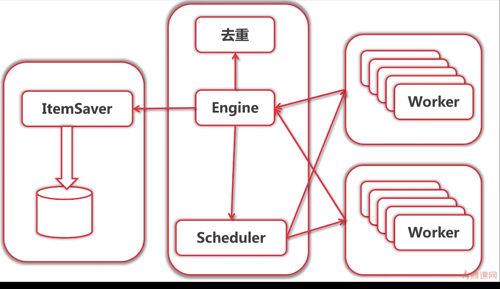

# richie_learn_golang
richie learn golang
# lang
    golang 基础语法知识学习
    
# crawler
    xx详情网站的数据爬虫
    
# crawler distributed
    改造为分布式爬虫
    
##项目架构

# notebook
    部分学习笔记

# future work
* 爬去更多的网站，使用css选择器/xpath分析数据
* 对抗反爬技术/遵循robots协议
* 模拟登陆，爬去动态网页
* 优化ElasticSearch查询质量  分词  Maping 配置查询
* 优化用户查询体验
* 爬去照片，动态展示
* 大数据，AI  elk技术栈
* 使用脚本进行部署
* 使用docker+ k8s(Kubernetes)进行部署
* 集成服务发现框架如consul(go 语言写的)
* 使用Logstash汇总和分析日志
