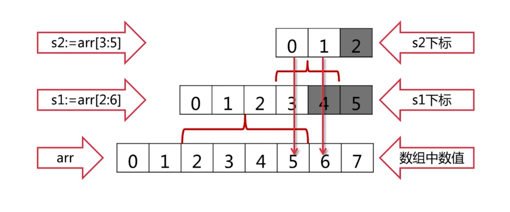
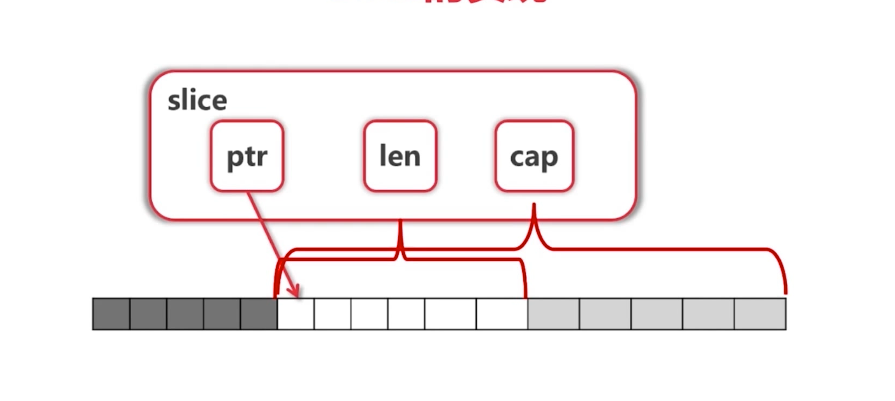

# 数组是值类型
* [10]int和[20]int是不同的类型
* 调用func f(arr [10]int) 会**拷贝**数组
* 在go语言中一般不使用数组

# Slice
```cgo
arr := [...]int {0,1,2,3,4,5,6,7}
s1 = arr[2:6] // 2 ,3 ,4, 5
s2 = s1[3:6] // 5
fmt.Println("s1=",s1)
fmt.Println("s2=",s2)
```
* s1的值为[2 3 4 5] s2 的值为[5 6]
* slice可以向后拓展，不可以向前扩展
* s[i]不可以超越len(s),向后扩展不可以超越底层数组cap(s)





# 向Slice添加元素
* 添加元素时候如果超越cap，系统会重新分配更大的底层数组
* 由于值传递的关系，必须接受append的返回值
* s=append(s,val)

