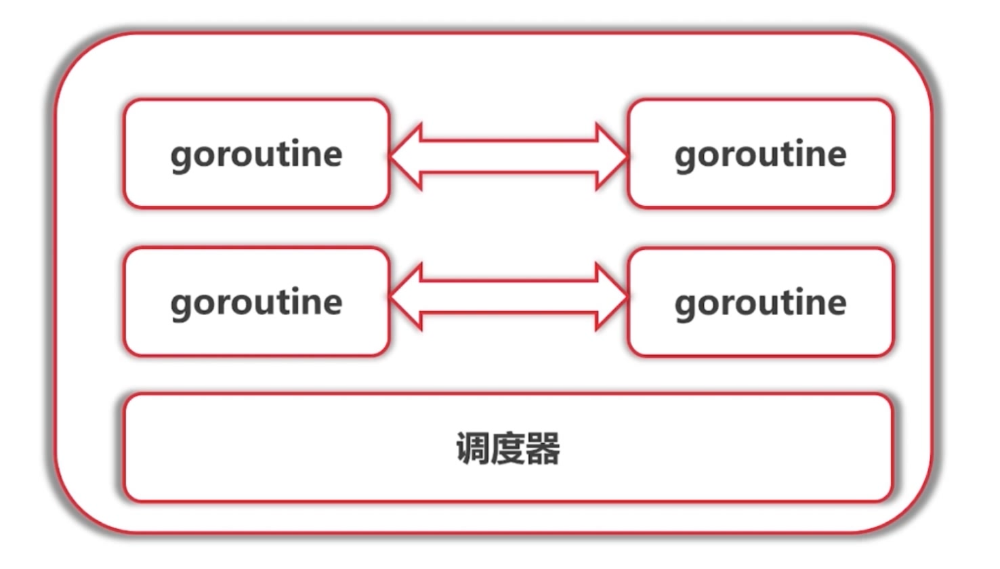

# goroutine可能的切换点

* I/O ， select
* channel
* 等待锁
* 函数调用（有时候）
* runtime.Gosched()

*只是参考，不保证切换 ，不能保证在其他地方不切换

 
 
 

# channel

* channel
* buffered channel
* range

# 发送发close 接收方有两种判断方法 ,ok 或range

# 理论基础 ： Communication Sequential Process(CSP)

# Dot't communicate by sharing memory;share memory by communicating.

* 不要通过共享内存来通信；通过通信来共享内存

# 例三  使用Select 来进行调度

* Select 的使用
* 定时器的使用
* 在Select中使用Nil Channel

# 传统的同步机制

* WaitGroup
* Mutex
* Cond

