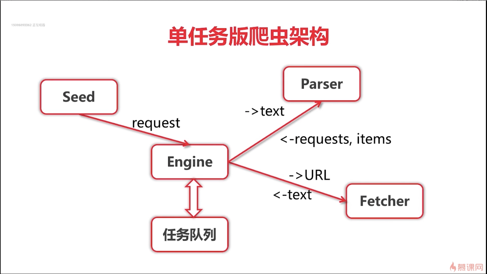
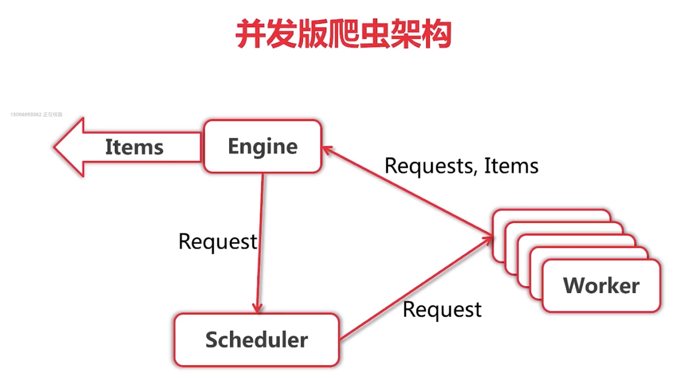
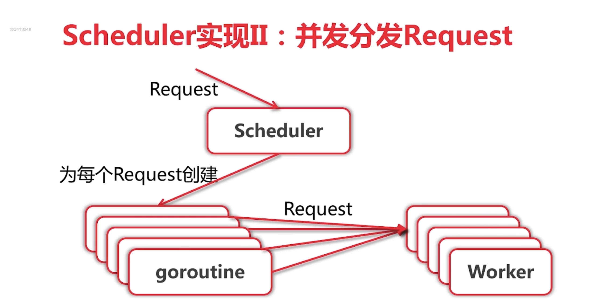
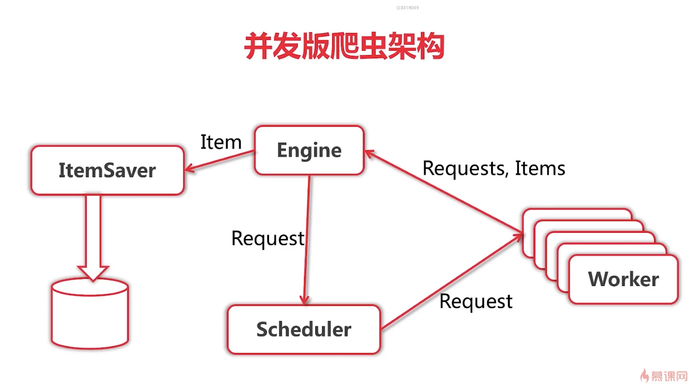

# 网络爬虫分类

* 通用爬虫
* 聚焦爬虫 从互联网获取结构话数据

* 把网页转化为数据  分布式爬虫

# go语言的爬虫库/框架

* henrylee2cn/plolcus 
* gocrawl
* colly
* hu19=7889/go_spider

# 不实用现成的爬虫库或框架
# 使用ElasticSearch作为数据存储
# 使用go语言标准模版库实现http数据展示部分

# 爬虫的主题

## 爬去内容
* 内容  如新闻，莫克，社区
# 爬去人
* QQ空间 人人网，微博，微信，facebook？
* 相亲网站，求职网站 对号

* 处于隐私和趣味性考虑 将爬相亲网站

# 如何发现用户
* 通过城市列表 城市 下一页 用户

通过用户-> 猜你喜欢

通过已有的id + 1 来猜测用户id

但任务 - 并发版本 - 分布式

# 获取城市名和链接
* 使用css选择器
* 使用xpath
* 使用正则表达式：可课程仅使用正则表达式

# 解析器Parser

* 输入：utf-8  编码的文本
* 输出： Request{URL， 对应Parser}列表，Item列表

# 单任务爬虫架构

# 并发版本爬虫架构

# Scheduler 实现IIIRequest队列和Worker队列

# Cheduler 实现II 并发分发REquest

# 如何存储items
为每一个item创建一个goroutine 提交给ItemSaver

* Imemsaver 的速度比Fetcher 快
* 例似SimpleScheduler的方式既可以
