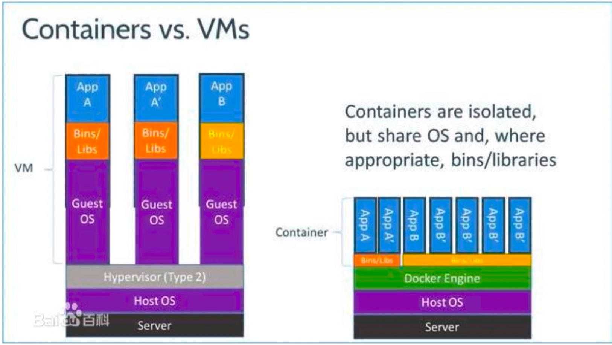

# ElasticSearch

* 全文搜索引擎
* 快速滴存储、搜索和分析海量数据
* 用户：危机百科、StackOverflow Github

# ElasticSearch 能做什么

* 存储我们的数据

* 不需要简表 配置字段等
* json格式的文档

* 寻找 有房 有车
* 寻找 女 年轻表了 身材好 
* 原生支持 不需要写代码 不需要凭借查询语句

# 安装
* 网站下载安装包  安装配置运行
* 直接使用docker

# Docker
* 容器引起
* 打包/发布应用程序，包括系统环境，配置，依赖
* 虚拟化，沙箱机制
* 解决了 在我机器上运行的好好地
* 使用Go语言编写的

# ElasticSearch 能做什么

<server>:9200/index/type/id

* index -> database 
* type -> table

# Elastic search 安装分词插件IK及问题解决

* 使用REST接口
* PUT/POST查 u 创建/修改数据，使用POST可以省略id
* GET 获取数据
* GET <index>/<type>/_search?q=全文搜索

# html/template

* 模版引擎
* 服务器段页面生成最终网页
* 适合做后台或维护页面