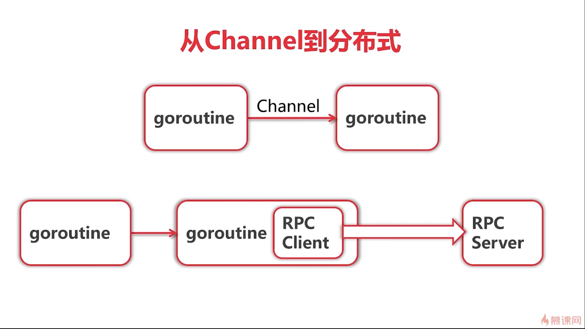

# 分布式系统

## 多接点
* 容错性能
* 可扩展性能
* 固有分布性能

# 消息传递
* 节点具有素有存储
* 抑郁开发
* 可扩展性能（功能）
* 对比： 并行计算

# 消息传递方法

* REST

* RPC  

* 中间件

# 一般消息传递的方法

* 对外： REST
* 模块内部： RPC
* 模块之间： 中间件 REST

# 分布式架构Vs 微服务架构

* 分布式 知道节点之间如何通信
* 微服务 鼓励按业务分模块
* 微服务架构通过分布式架构来实现

# 多层架构 vs 微服务架构
* 微服务架构具有更多的"服务"
* 微服务通常需要配合自动化测试、部署、服务发现等
* 目前我们倾向于微服务架构

# 并发版本爬虫架构

# 并发爬虫

 

# 存储问题
* 存储部分的结构，技术栈和爬虫部分区别很大
* 进一步优化需要特殊的Elastic Search 技术北京
* 固有分布式

#本课程架构
* 解决限流问题
* 解决存储问题
* 分布式去重 回家作业

# 项目架构

# 重Channel 到分布式

# RPC
* jsonrpc
* grpc 使用protobuf  google
* Thrift    facebook

# 自由协议
* docker/libchan
* NATS straming
* gocircuit
* 根据自己需求

# 解析器的序列化/反序列化
* 解析器原先的定义为函数  
* 需要处理的函数序列化/反序列化

