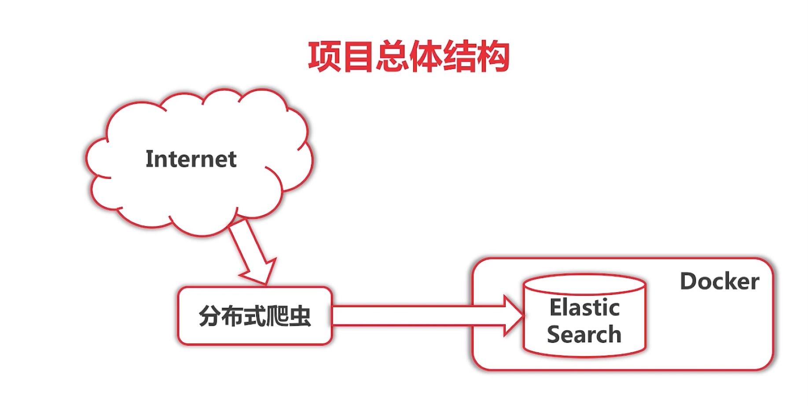
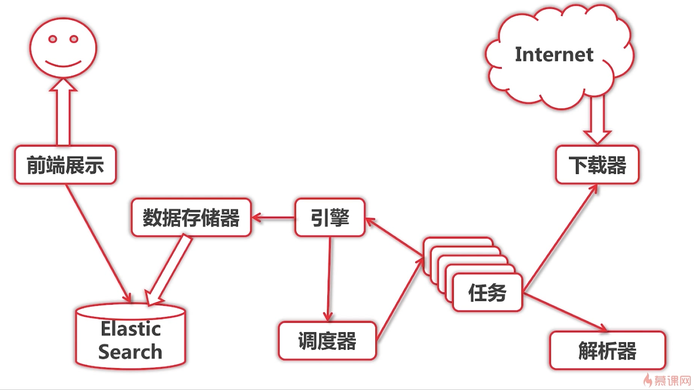

# 哪些go语言没有的元素
* 类，集成，多态，重载
    * go语言有不同的世界观
    * 面向对象界，也流行变集成为组合的思维
    * 这些免洗那个对象的元素太容易滥用
    * go语言为组合提供了便捷的支持
* try/cache/finally
    * 太多错误被当作异常
    * 很多c++项目组本身禁用try/catch
    * 正确的使用try/catch处理错误，导致代码混乱
    * try/catch在产品代码中并不能减少开发人员负担
    * defer/panic/recover模式
     
* 构造函数/析构函数/RAII
    * 大型项目中很少用到构造函数，多使用工厂函数
    * 值类型的构造有构造题初始化语法实现
    * RAII技巧性太强，隐藏了意图
    * 析构函数与垃圾回收不匹配
* 泛型
    * 泛型作为模版类型
    * 泛型约束参数类型
###c++中duck typing
    ```c++
    template  <class R>
    string download(const R& retriever){
        return retriever.get("www.baidu.com");
    }
    ```
    * 实际想实现duck typing
    * go语言提供了对 duck typing，以及接口的组合支持

###   泛型约束参数类型
    ```cgo
        List<Interger>.add("abc) // complie error  
        List<String>.add("abc) // ok  
    ```
    * 本身非常复杂：类型通配符，covariance等问题
    * go语言本身自带强类型的slice，map，channel
    * 使用type assertion甚至go generate来实现自己的泛型
    * 反省支持是作者唯一态度不强硬的点
   
* 操作符重载
    
* assert  
    * 主要用于测试代码
    
    
#课程总结
##基本语法
* 变量
* 选择，循环
* 指针，数组  slice ，容器 map 如果一个值不在map 取回的值为零值

## 面向接口
* 结构体
* duck typing的概念
* 组合的思想
##函数式编程
* 闭包的概念
* 多样的例题
## 工程化
* 资源管理，错误处理
* 测试和文档
* 性能调优
## 并发编程
* goroutine和channel
* 理解调度器  非抢占式多任务  交出cpu式由程序调度者决定
* 多样的例题
##标准库
* fmt,log
* errors
* io (read writer), bufio (通过buffer提高io性能)
* time  Tick(每个多少秒，会有一个信号，channel)  ask(给我们一个channel，在select中做超时的动作)
* net/http,net/rpc
* html/template
* charset,encoding,unicode,utf8
* strings,bytes,strconv
* regexp
* flag
* math  欧拉公式
* os  打开文件
* pprof 获取性能日志
* runtime 在goroutine如何通过 runtime.Gosched() 主动交出控制权
* reflect 
* tesing
## 实战项目
* 使用Go语言自主搭建简单分布式爬虫
##项目总体结构

##详细架构



