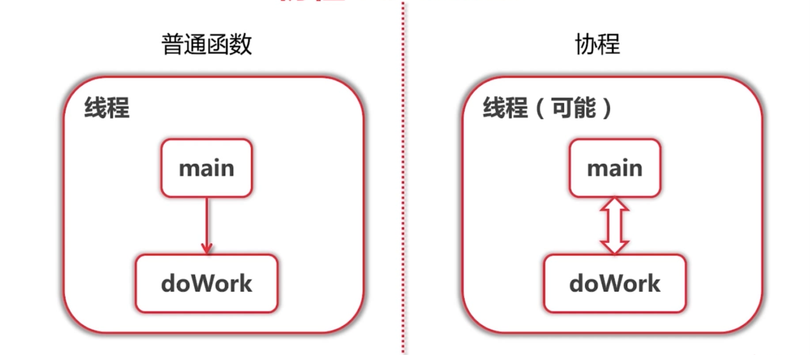
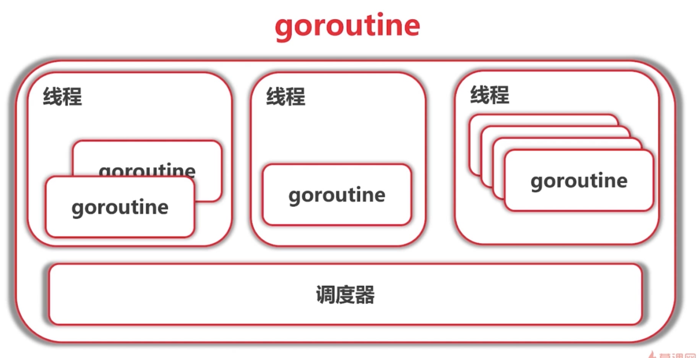

# goroutine

```go
package main

import (
	"fmt"
	"time"
)
func main() {
	for i := 0; i < 100000 ; i++{
		go func(i int) {
			for {
				fmt.Printf("Hello from "+
					"goroutine %d\n", i)
			}
		}(i)
	}
	time.Sleep(time.Microsecond)
}
```

# 协程 Coroutine

* 轻量级"线程"
* **非抢占式**多任务处理，由协程主动交出控制权
* 编译器/解释器/虚拟机层面的多任务
* 多个协程可能在一个或多个线程上运行


* 子程序 是协程的一个特例   -- Donnald Knuth



#其他语言中的协程

* C++： Boost.Coroutine
* Java： 不支持
* Python： 
    *使用yield关键字实现协程
    * python3.5 加入了async def 对协程原生支持
    


# go 语言的goroutine



* 任何函数只需要加上go 就能送给调度器运行
* 不需要在定义时区分是否是异步函数
* 调度器在合适的点进行切换
* 使用-race 来检测数据访问冲突


# goroutine可能的切换点

* I/O ， select
* channel
* 等待锁
* 函数调用（有时候）
* runtime.Gosched()

*只是参考，不保证切换 ，不能保证在其他地方不切换

 